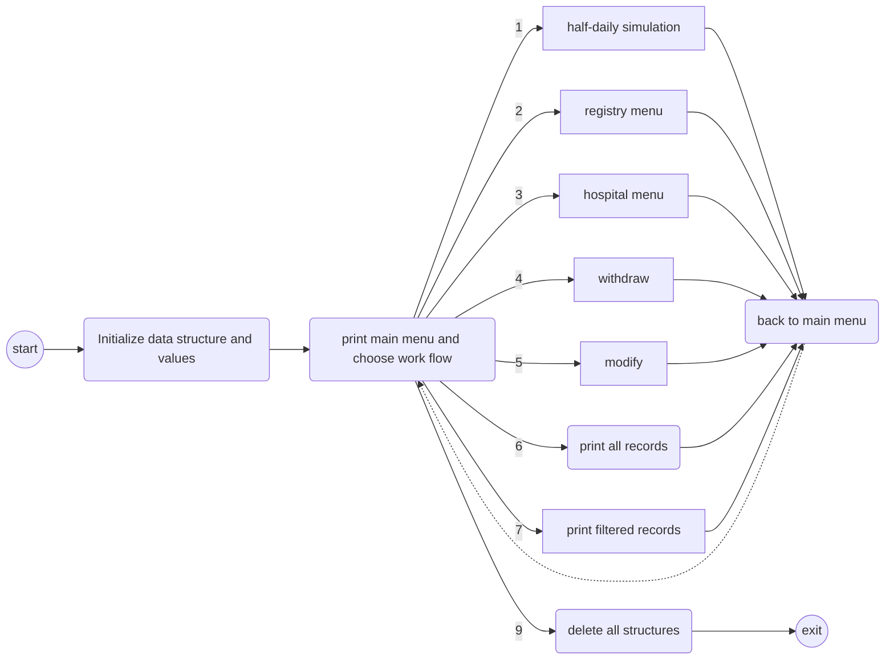
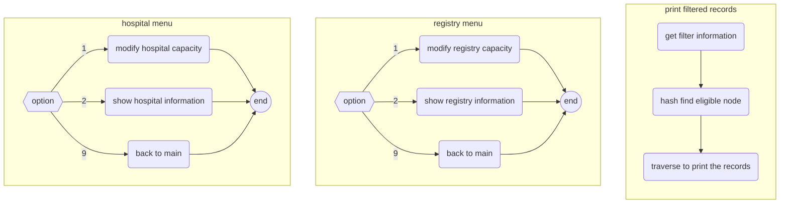
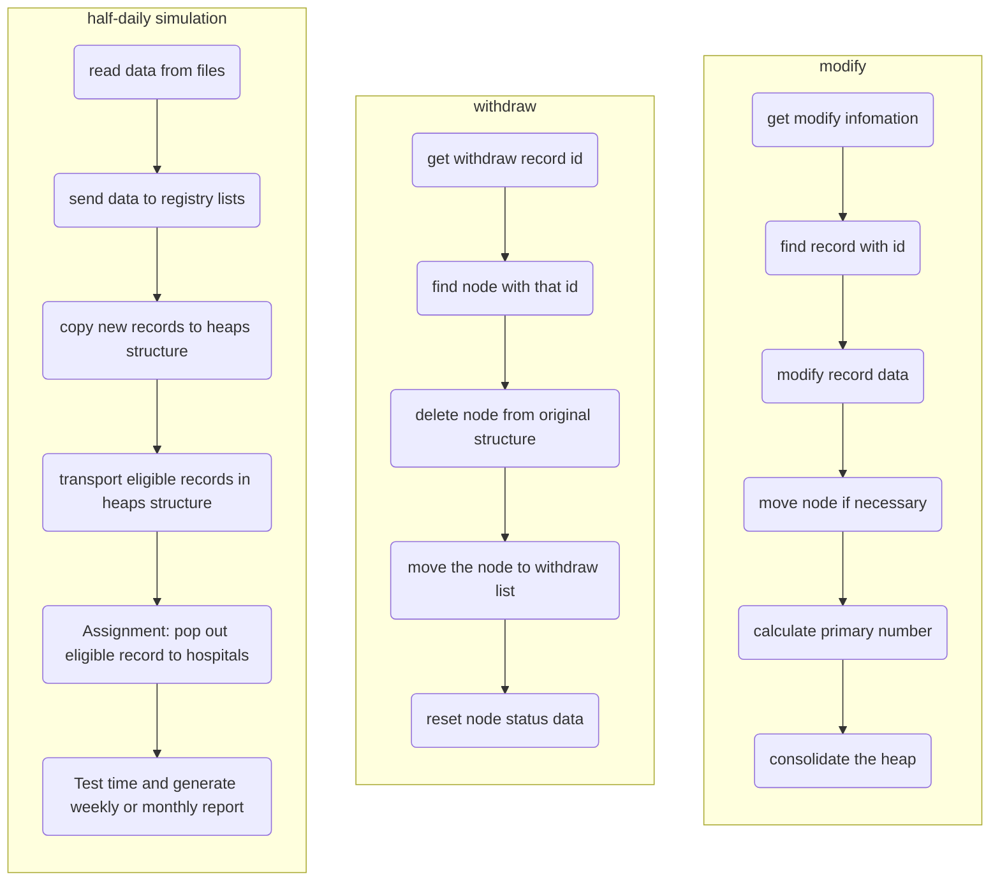

# CS225-CA Presentation	

---

CS225_SP22_Group_D7

05-22-2022

​		Here is our group's C++ project, the Computing Assignment 2 of CS225. It analogs a simplified hospital registration system using key structures like double linked-list, Fibonacci heap, B tree, B+ tree, and Hash table.

## Programmers' Information

Wang Jie - ZJU-UIUC Institute

Hong Jiadong - ZJU-UIUC Institute

Cai Yitao - ZJU-UIUC Institute

Yang Peidong - ZJU-UIUC Institute

## Input Testcase

​	As shown in the figure below, the input testcase is consist of a series of documents named after "DataXX.csv", where XX ranges from 01 to 15. 

​	All input data are generated by [onlinedatagenerator.com](https://www.onlinedatagenerator.com/), with some improvement. Based on real databases and are highly creditable.  


## System Structure

​	Our project is highly 

Shown in the picture below, we take registry station as 


## Main Program Process Flow

```text
==========================================
            >>  Main  menu  <<            
------------------------------------------
[1] Time step forward for half day
[2] Set up registry information
[3] Set up hospital information
[4] Withdraw a record with id
[5] Modify a record information with id
[6] Print all the records that have been rescued.
[7] Filter records
[9] Quit the program
------------------------------------------
  May.30, 2022                   14:13
==========================================
```

As shown in above, we made GUI to select operation and control overflow.







## Functionality

### Registration

A person can register for medical treatment at a local registry. For the registration the following information is required:

> – the identification number of the person,
>
> – the name and contact details (address, phone, WeChat, email) of the person,
>
> – the profession of the person,
>
> – the date of birth of the person,
>
> – the medical risk status of the person.

Each registration record will receive a timestamp, i.e. the date and the time of the registration will be stored. The professions are classified into eight profession categories I to VIII. There are seven age groups: children (≤ 12 years), adolescents (≤ 18 years), young adults (≤ 35 years), adults (≤ 50 years), seniors (≤ 65 years), elderly people (≤ 75 years), and old people (> 75 years). There are four different risk status: no risk (0), low risk (1), medium risk(2), and high risk (3). 

Registration records are stored permanently. In addition, records with relevant information such as identification, profession category, age category, risk status, registration date and time are kept in a queue, which twice daily is forwarded to the centralised treatment queue. Data from different local registries is added to the centralised queue in random order, but the order from the local queues is preserved.

### Queueing and assignment of appointments 

The assignment of an appointment for receiving treatment is organised according to priority. The most important criterion is the profession category followed by a ranking of age groups, and further followed by data and time of the registration. Only people with no or low risk are considered. For people with medium risk a one month extension is added; people with high risk are only considered when there are no others waiting in the queue.

A person may withdraw from the treatment at any time. Those who have withdrawn and then registered again are considered with additional two weeks waiting time, unless they are in the medium or high risk group.

Furthermore, the profession category and the risk status of a queueing person may change. If this affects increases the priority in the queue, the relevant attributes are updated. A person may also present a priority letter with a deadline for the treatment. At the latest a person is assigned an appointment before the deadline regardless of the other selection criteria.

### Appointment processing

When a person has highest priority in the priority queue, an appointment location, date and time (usually the next day) is assigned and registered. With this the person leaves the queue. There are several locations for treatment processing each with a daily capacity and associated time slots for the treatment. Usually, the closest location is selected for a person.

The right to withdraw is reserved. When the treatment has been processed at the designated location at the reserved day and time, this is also registered

### Reporting 

The system shall produce weekly reports comprising

> – the people who have been treated including their profession category, age category, risk status and the waiting time from registration to treatment,
>
> – the registered people with a set appointment including their profession category, age category, risk status and their waiting time until now,
>
> – the queueing people without a set appointment including their profession category, age category, risk status and their waiting time until now.
>
> It must be possible to order these reporting lists by name, profession category or age group.
> In addition the system shall produce a monthly statistics report showing how many people have registered, how many of them are waiting, how many are waiting in total, how many treatment appointments have been made, the average waiting time, and the number of people who withdrew their registration.

## Detailed Settings

We set 5 registries and 3 hospitals. 

The prepared input files are 5 registry_n.csv files, each file contains 500 people, each file represents the person that are registered in a registry.  Each half day there will be 5 people per registry, 25 people in total, being plugged from the file to the queue, standing for that they were registered. 

And each hospital, can deal with 8 people per day. Each day, although the queues put people into Fibonacci heap for twice, the hospital only makes appointments for the next day by once. After they are “treated”, they will be put into an Alist archive. 

Each person will have the following arttributes: 
id, registration, name, address, phone, Wechat, profession, birth, register_time, risk status, hospital, regist_halfday, treat_halfday, withdraw, withdraw_halfday, reinsert_halfday, risk2halfday, ddlletter, treatment, Euclidean_address, health_care_card; 

And these properties are stored into 4 relations which are in struct form. We established a B+ tree for each relation, thus there are 4 in total, and these B+ trees use id as the primary key. Also, we establish a B tree and a hash table to search for data based on secondary keys, health card number and risk status resp. When you enter the secondary key information, you can get the id and search for the corresponding information of those people with the secondary key in the B + tree.      


## Program Usage

Download all the files and run makefile, all the information to display will be shown on the console. There are two checkpoints, follow the user interface and test our system. Have fun!